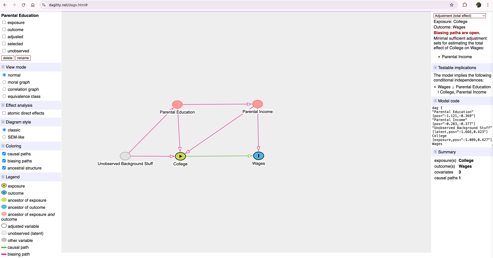
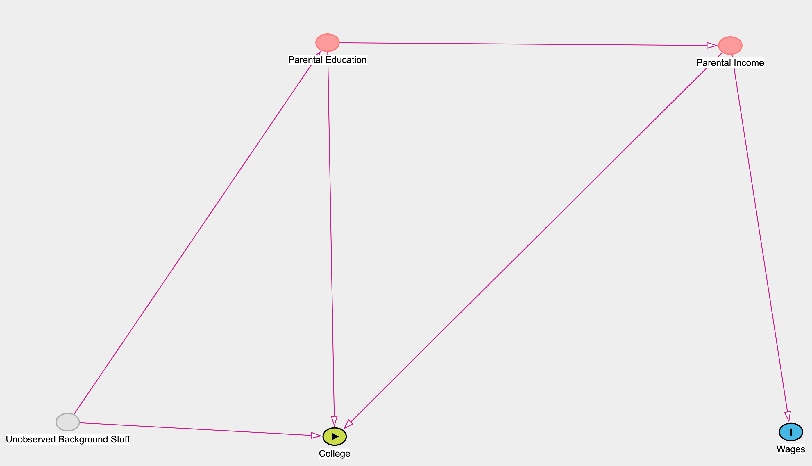
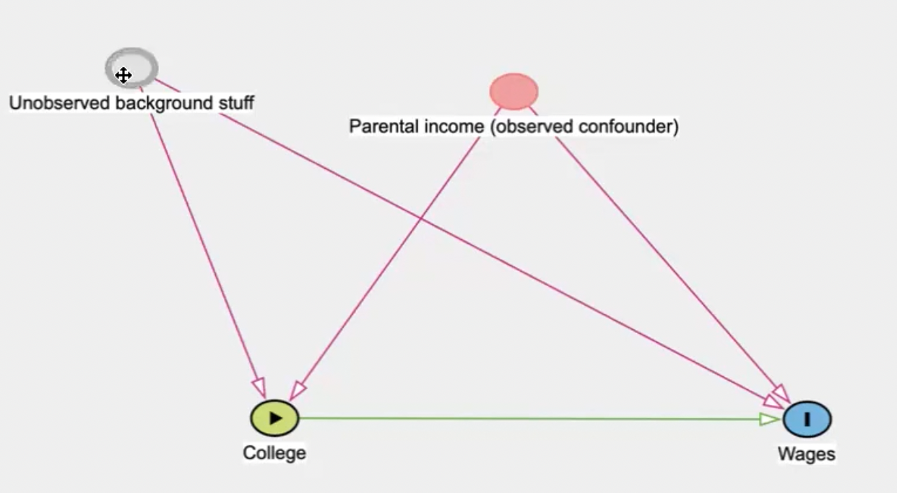
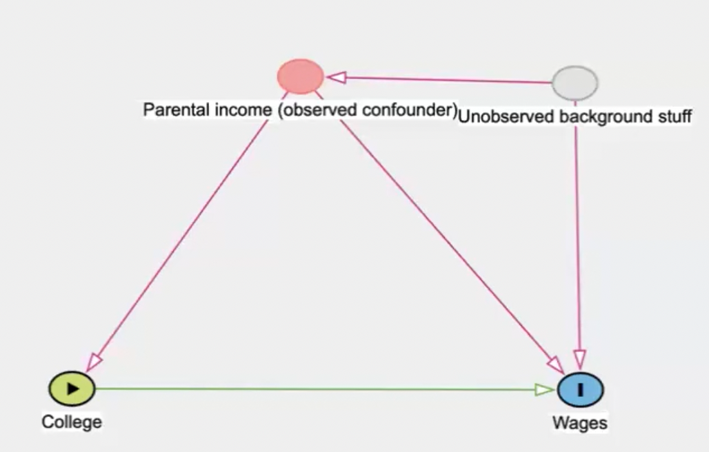

# Day 2 notes

## Will discuss

- Directed Acyclic Graphs
- Unconfoundedness
- Estimators

## Day 1 review

- The two defining elements of the design approach to causal inference (as opposed to the model approach)
    - the individual and average potential outcomes which help define the causal parameters
        - one can always frame their causal research question in terms of potential outcomes, not in terms of regression, as regression is just one of the ways to use covariates, and is not necessarily better than the others
    - the treatment assignment mechanism tells that there are different reasons that units get treated, are the other thing that help define the causal parameters
      - independence/randomization (`(y1, y0) _||_ D`)
- Simple difference in outcomes. (SDO = ATE + Selection bias + Heterogeneous treatment effect bias)
  - Any analysis done can be framed this way: comparing two groups with one another (take regression or any covariates, at its core it is this), and when compared they will always have some version of this.
    - average causal effect, selection bias, heterogeneous treatment effect bias (difference in the returns to the treatment for the two different treatment groups)
  - In independence in treatment assignment mechanism, we can 'delete' the biases on selection and on difference in returns as the assumption is that they are truly independent (eg. if independent of race, `E[Race|D=1] = E[Race|D=0]`)
- The randomized experiment is the "gold standard" of causal inference. It effortlessly deletes the selection bias and heterogeneous treatment effect bias in any comparison that is made between treated and control group.
  - Randomization needs to be designed carefully to ensure it
  - In a randomization, if you randomize with respect to Y(0), Y(1), sex and race, only sex and race are directly testable because Y(0) will not be observed for D=1 group and vice versa. We cannot know `E[Y(0)|D=0]=E[Y(0)|D=1]`, it is assumed/deduced when randomization is correctly applied.
  - Prior to randomization, every unit has two potential outcomes, Y(0) and Y(1)
  - Realized outcomes happen after the treatment assignment (e.g. randomization)
- A SUTVA violation means the realized outcome of an individual unit is no longer based on their potential outcome, it is based on somebody else's treatment assignment

## Confounding

- The treatment assignment mechanism is based on a covariate.
- Anything that is trying to estimate a causal effect by including covariates, is called selection on variables, in terms of regression is called exogeneity, Don Rubin called it unconfoundedness and ignorability, in computer science it is called backdoor criterion

## Directed Acyclic Graphs

- D - directed, referring to graph theory, if two nodes are connected by one line, its a direct edge
- A - acyclic, moves in one direction, no feedback loops. Limits its usefulness to economics (e.g. supply and demand curves) or any other example in other fields where things are being determined by real world simultaneously. Its a limitation in a sense that it is an imposed constraint
- G - graph, referring to graph theory
- DAG is a model approach, not a design based approach, it doesn't look for natural experiments
- try www.dagitty.net 
- If we want to estimate the causal effect of "college" on "wages" but can't run a randomized experiment randomizing "college" in the population, then if a DAG we create involving parental education, parental income, unobserved background stuff (e.g. access to books at home), college and wages, according to Pearl's DAG approach logic, we might be able to "control" for the confounding variables that would otherwise create selection bias.
  - `SDO = E[Wages|College=1] - E[Wages|College=0] = ATE + E[Y(0)|C=1] - E[Y(0)|C=0] + (1 - share of population in college [pi]) * (ATT - ATU)`
    - ATT is average treatment effect of college on the college students
    - ATU is average treatment effect of college on non-college students
    - ATE is average treatment effect of college for everybody
    
  - This DAG creates selection bias, let us assume for now that ATT=ATU so there is no heterogeneous treatment effect bias so `SDO = E[Wages|College=1] - E[Wages|College=0] = ATE + E[Y(0)|C=1] - E[Y(0)|C=0]` so we are left with selection bias. 
  - In the graph, the selection bias comes from all the other ways that we can get from college to wages that is not the causal effect (and not something else called collider path)
  
  - It is not yet about direction, what are all the ways from college to wage THAT IS NOT CAUSAL (and not cyclic)?
    - College <- Parental Income (PI) -> Wage
    - College <- Unobserved Background Stuff (UBS) -> Parental Education (PE) -> Parental Income (PI) -> Wage
    - College <- PE -> PI -> Wage
  - vs the one thing we actually care about: College -> Wage
  - Is there any way to block out the not causal ones and only keep the causal college -> wage?
  - DAGs start out formally by describing the exact specification of models that would "block out" the other non-causal paths from the treatment to the outcome
  - Definitions from the original DAG (uses a lot of genetic language cos of its originator)
    - UBS is a *parent* of PE and College
    - PE and College are *descendants* of B
    - There is a *direct (causal) path* from College to Wages
    - There is a *mediated (causal) path* from UBS to Wages through College
    - There are a lot of *paths* from PE to Wages but none are direct, some go *downstream* and some go *upstream*
  - Understanding colliders
    - PE -> College -> Wage (causal path, mediated through College)
    - PE -> College <- PI -> Wage (non-causal path because College is in that sequence of events something called a "collider")
    - Colliders appear different from non-colliders on a sequence of edges
    - In the first sequence of edges (or "path") notice only one arrow points to College, in the second sequence of edges, arrow on the left points to College (PE -> College) and arrow on the right points to College (College <- PI)
    - Colliders have two arrows pointing to them and colliders only make sense in terms of a path, not a variable
    - PE's causal effect on College and PI's causal effect on College are "colliding" with one another at College on that path
  - DAGs are meant to represent your beliefs, they originate from your beliefs (truth?) about the treatment assignment mechanism, and your selection of the units in your data.
  - You don't have the data and then create a DAG, you create a DAG and then get the data
  - A confounder in the path College <- PI -> Wage
    - PI is not a collider
    - If there is only a non-collider or a series of non-colliders connecting the treatment to the outcome, then we say that this path is "open" and if it is "open" then College and Wage are spuriously correlated. What that means is if we run a regression, Wage ~ a + delta College + error, estimate with OLS, delta hat = ATE + selection bias. Selection bias would be based on College = 1 having a different distribution of PI than College = 0, and the fact that PI causes Wage. 
    - Extreme example - there are two things that cause you to get treated
      - If you are a male, you get treated
      - randomness
      - D = 1 will have more males than D = 0
      - Confounding is discussing different distributions in the treatment and control but it is only a problem if that variable causes D and causes Y
  - Backdoor paths D <- X -> Y, X is not a collider, if X is not a collider then the path is open, so you can close backdoor paths by controlling for those confounders but the confounders must be KNOWN and QUANTIFIED correctly (observed)
    - If the confounder is known because of the DAG and is in the dataset then it is observed, and therefore it is solvable
      - Y ~ alpha + delta D + beta X + e
      - When we run regressions with covariates, we have been assuming that you had a DAG and that those variables "closed all the backdoor paths"
    - The simplest way to estimate the average effect of D on Y is to take weighted averages
      - say X is age and X=1 "older" and X=0 "younger". 75% of sample is young, 25% is older.
      - Estimate of ATE would be: (E[Y|D=1, older]-E[Y|D=0, older])*0.25 + (E[Y|D=1, younger]-E[Y|D=0, younger])*0.75
      - OLS does this kind of thing also but the weights are a little different with OLS.
      - DAGs tell us which covariates to control for, not which model.
      
      - Backdoor paths from D to Y:
        - College <- PI -> Wages , PI is a non-collider, can close it by controlling for it
        - College <- UBS -> Wages , UBS is a non-collider but it is not observed (not in the dataset) so can't be controlled for, so cannot close the open path
        - Therefore, there is no "control strategy" that will allow to estimate the causal effect unless we can get data on background stuff.
      
      - Backdoor paths from D to Y:
        - College <- PI -> Wages (PI is non-collider, observed, can control for it to close the backdoor path)
        - College <- PI <- UBS -> Wages
        - All we need to do to close a path
          - if there is any observed non-collider on that path, and you control for it, the entire path is closed, it does not matter what else is on the left or right of it
          - if the variable is a collider, collider always close backdoor paths (so as long you don't control for them)
        - If you believe that you can identify a causal effect by "controlling for covariates" you have to have a DAG in mind. You cannot be controlling for colliders and you don't gain a lot by controlling for things that are irrelevant
- Backdoor criterion - conditioning on X satisfies the backdoor criterion with respect to (D, Y) directed path if a) all backdoor paths are blocked by X b) no element of X is a collider
- Colliders are "bad controls", when you control for them, they create new previously non-existent spurious correlations. This is the risk of blindly controlling for variables, you might inadvertently include bad or irrelevant controls. (shown in the movie star example in the py notebook)
- To control for omitted variable bias, I've made the mistake at times to include many "controls" as possible without thinking about treatment assignment mechanism and therefore not thinking about which variables are colliders, covariates or confounders, ML can be "naive" if the large dimensions of features includes colliders unknowingly
- The paper by Paul Hunermund, Beyers Louw, Itamar Caspi on double machine learning and automated model selection warns about the DML method to select control variables in a data driven way and reliance on the causal model. (need to read and come back to update this)
- If we don't have a DAG we feel confident about
  - definitely include the confounders we do feel confident about
  - don't put in any variables that are outcomes as controls, eliminate variables that are measured after the treatment / treatment assignment
  - pick covariates that are highly predictive of the missing counterfactual (e.g. Y0 for the ATT)
- Imbens and Rubin (2015) suggest falsification. Using lagged outcome from pre-treatment as a way of checking as those have similar confounder structures.
  - They recommend falsification to validate DAGs (they don't call them DAGs but this is what they recommend to validate)
  - Persons A are in the treatment group in 1989 but not in 1988, so run your model on 1988 controlling for the covariates you think you need to control for
  - If you find the treatment affects the outcome conditional on the control, at a period of time when no one was yet treated, your DAG is probably wrong. There is something missing in the controls.

## Unconfoundedness

- When it is done well RCT can eliminate selection bias, but there can be poorly designed RCTs
  - underpowered study (power calculation is wrong), researcher not understanding the study they are doing, there is attrition in the test sample
- Non experimental/observational causal studies, well designed, can be better than poorly designed RCTs
- "Design trumps analysis" - design phase includes conceptualizing the study, identifying the relevant covariates and establishing the assignment mechanism
- Write down your core question using potential outcomes, if you cannot, it is either not a causal study or you're not ready to proceed
- Think about running the study as though you were running a hypothetical RCT, frame it as imagine if it was possible, what RCT would I be running? A clear definition of the RCT, the treatment group, the control group, the randomization, setup of the study, the implications of the study
- The same dataset can have different hypothetical experiments, same data can be conceptualized in multiple ways leading to different experiments. Instead of running a regression on all of the different variable sin the dataset, thinking about each of them as their own experiment with their own DAG would help
- Be able to reconstruct the assignment mechanism. Understand how it would be done in a RCT and then mimic the process for the observational study. Who chose the treatment, why, what did they know, what influenced the treatment assignment, if this cannot be done, then it may not be time to move to analysis yet.
- It is essential to be explicit about the treatment and the outcome.
- The purpose is not to come up with the right answer, but it will make you have an opinion, it will make you stake a claim in the design stage. "I don't know what the DAG is, I have spent time on this, I have to come up with an answer and I am going to do this, these are my assumptions and I am willing to make them."
- Two approaches to unconfoundedness - weights and matching and OLS, each has strengths and weaknesses, cannot be ranked
  - weights and matching - common support - subclassification - nearest neighbor matching - propensity scores
  - OLS - functional form - regression weights - regression adjustment - machine learning
- To work on these unconfoundedness approaches, we are assuming that we have  a project, we are satisfied with the selection of the covariates, we have no colliders, we know why we are picking the ones we picked.

- First define your target parameter
  - frame your question in terms of the average treatment effect and think about the population that will get the treatment, can help you estimate a parameter and interpret results
  - being careful about knowing whether it is the ATT (average effect for the treatment group) or the ATE (average effect of treatment on everyone) that you care about
  - Diff-in-diff models estimate only the ATT, the covariate methods can estimate the ATT, ATU and ATE
  - e.g. if we are looking at the effect of discrimination on earnings. If the sample is of men, women, non-binary, they each have a "treatment effect" associated with discrimination
    - Sejal Y(1): earnings if discriminated against
    - Sejal Y(0): earnings if not discriminated against
    - delta_sejal = Y(1) - Y(0)
    - Scott Y(1): earnings if discriminated against
    - Scott Y(0): earnings if not discriminated against
    - delta_scott = Y(1) - Y(0)
    - Assume women are the discriminated group
    - ATT: average effects of discrimination for women (the discriminated group)
    - ATU: average effects of discrimination for men (the non-discriminated group)
    - ATE: average effects for both
    - Most discrimination studies focus on ATT
  - If you had the information you needed, what do you plan to do with it?
    - If you want to vaccinate the entire population, you want to know the ATE
    - If you want to know the effect of the food hunger program on the very people who are probably going to be targeted by the program then you want to know the ATT. As opposed to the effect of the program on rich people ATU. Or everyone ATE.
- When attempting to estimate the aggregate causal parameters using covariate adjustments two assumptions need to be made:
  - unconfoundedness - selection on observable covariates such that all remaining variation in the treatment is random - the DAG can tell us this
  - common support
- Assumption of unconfoundedness Y0, Y1 _||_ D | X (let us assume X in this case is sex)
  - E[Y1|D=1, Male] = E[Y1|D=0, Male]
  - E[Y0|D=1, Male] = E[Y0|D=0, Male]
  - E[Y1|D=1, NonMale] = E[Y1|D=0, NonMale]
  - E[Y0|D=1, NonMale] = E[Y0|D=0, NonMale]
  - If you have selection on observables, i.e. unconfoundedness, then the equality still holds for the same characteristics of X
- Weak unconfoundedness Y0 _||_ D |X - the person made the decision only base don Y1 and ignored Y0.

## Subclassification

    